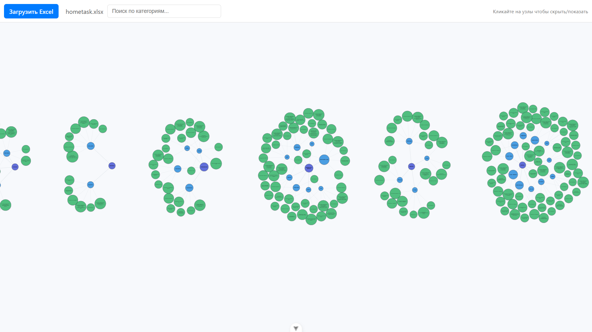
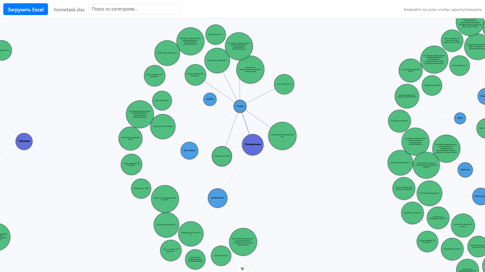
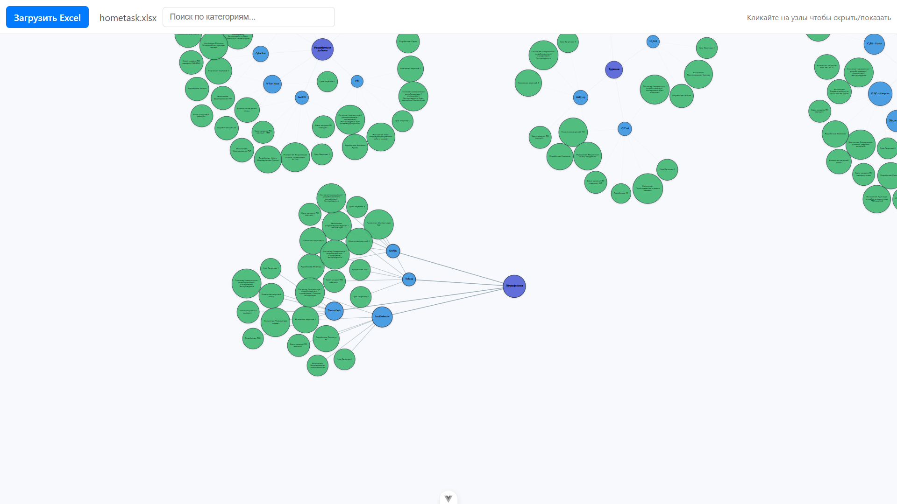
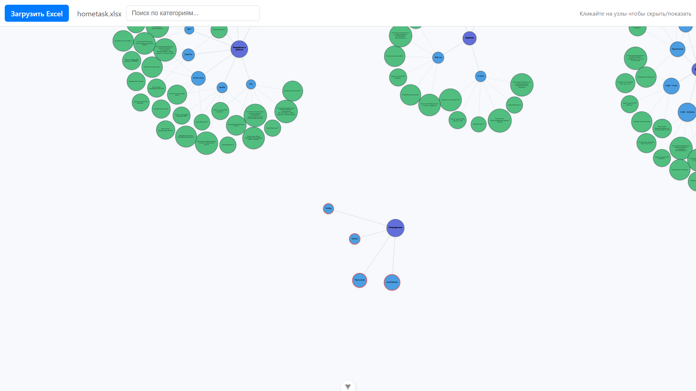

# chartDirectedTree
Веб‑приложение для визуализации данных из Excel в виде collapsible force‑directed tree (D3 + Vue 3).

# Требования
Перед запуском убедитесь, что у вас установлено:
 - Node.js версии 20.19.0 или выше (подойдёт также 22.x)
 - npm (идёт вместе с Node.js)

Проверка:
  - node -v
  - npm -v

# Установка
1. Склонируйте репозиторий:
   - git clone <URL_РЕПОЗИТОРИЯ>
   - cd itproger
2. Установите зависимости:
   - npm install
     (Будут установлены vue, d3, xlsx, vite и другие зависимости из package.json.)

# Запуск проекта
запустите проект с помощью файла run.bat для windows или run.sh на Linux.

Либо же в терминале компилятора пропишите

npm run dev

После запуска откройте в браузере адрес, который выведет Vite (обычно: http://localhost:5173).

# Использование

1. Запустите проект
2. Нажмите «Загрузить Excel».
3. Выберите файл формата .xlsx или .xls.
4. Данные автоматически отобразятся в виде дерева.

Возможности:
  - клик по узлу — свернуть / развернуть ветку
  - перетаскивание мышью — перемещение узлов
  - колесо мыши — масштабирование
  - поиск по категориям

# Формат Excel‑файла
- Используется первый лист книги.
- Первая строка — заголовки.
- Автоматически ищутся колонки:
    - категория: категория / category
    - продукт: название / product / name
    - Остальные колонки преобразуются в атрибуты узлов.
 # Структура проекта
 src/
 App.vue (загрузка Excel, поиск, подготовка данных)
 
 components/
  ForceDirectedTree.vue (D3 force‑directed визуализация)
